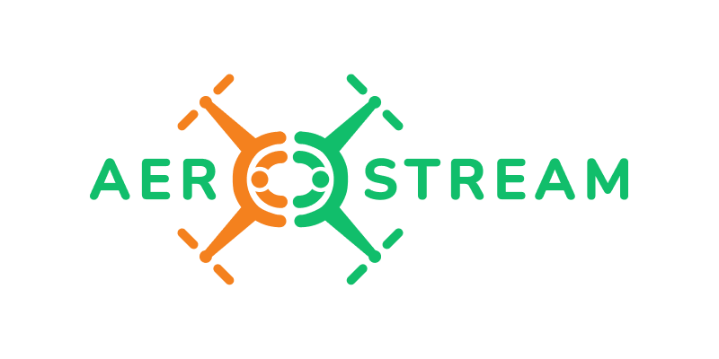

Built on lessons learned and experience gained upon successful implementation of twinning project AeroTwin, this proposal is conceived as an effort to stream AeroTwin positive effects on a network of Higher Education Institutions (HEIs) from Croatia and Bosnia and Herzegovina in order to enlarge capacity for research and innovation, and to prepare and establish a long lasting and integrated cooperation between those institutions and their partners in the local ecosystem. The essential support to reach this objective and prepare the network to facilitate future synergies with the European Universities initiative, will come from three internationally-leading HEIs from Spain, Czech Republic and the Netherlands. Additionally, increase of innovation capabilities of widening HEIs will be achieved through close cooperation with FADA-CATEC and Technological Corporation of Andalusia (CTA), leading European research and innovation intensive organizations, deeply involved in the most relevant EU initiatives and projects. The long lasting and integrated cooperation between institutions will be established in the field of autonomous aerial systems (AAS) applications, with emphasis on smart agriculture, forestry and logistics. The project objectives are i) integrated and long term cooperation between HEIs from Croatia and Bosnia and Herzegovina, with partners from Spain, Czech Republic, and the Netherlands, ii) increased scientific excellence profiles of HEIs from Croatia and Bosnia and Herzegovina in the field of autonomous aerial systems, and shared capacities with partners from Spain, Czech Republic, and the Netherlands, and iii) improved quality of innovation management, technology transfer and citizen involvement of HEIs from Croatia and Bosnia and Herzegovina. Particular set of actions is planned for achieving those objectives, such as common innovation strategy, staff exchange, experts visits, workshops and tutorials, hands‐on trainings, and PhD students co-mentoring.

# **Objectives**

## **Objective 1**

Integrated and long-term cooperation between HEIs from Croatia and Bosnia and Herzegovina, with partners from Spain, Czech Republic, and the Netherlands in the field of autonomous aerial systems applications, with emphasis on smart agriculture, forestry, and logistics.

This Objective will be achieved through:

- Identification of resources and challenges of w-HEIs
- Preparation of an action plan for long term cooperation
- Preparation to embark on the future European Universities Initiative 

## **Objective 2** 

Increase in scientific excellence profiles of HEIs from Croatia and Bosnia and Herzegovina in the field of autonomous aerial systems, and share capacities with partners from Spain, Czech Republic, and the Netherlands.

This objective will be achieved through:

- Raising scientific excellence
- Promoting talent and preventing brain drain
- Implementation of a shared infrastructure plan 

## **Objective 3** 

Improvement of quality of innovation management, technology transfer and citizen involvement of HEIs from Croatia and Bosnia and Herzegovina.

This objective will be achieved through:

- Developing an innovation strategy
- Strengthening innovation capacity
- Mainstreaming entrepreneurial mind-set of researchers
- Inducing cooperation with industry stakeholders-Science in society-Outreach to children, schools, and general public
- Open Science 
